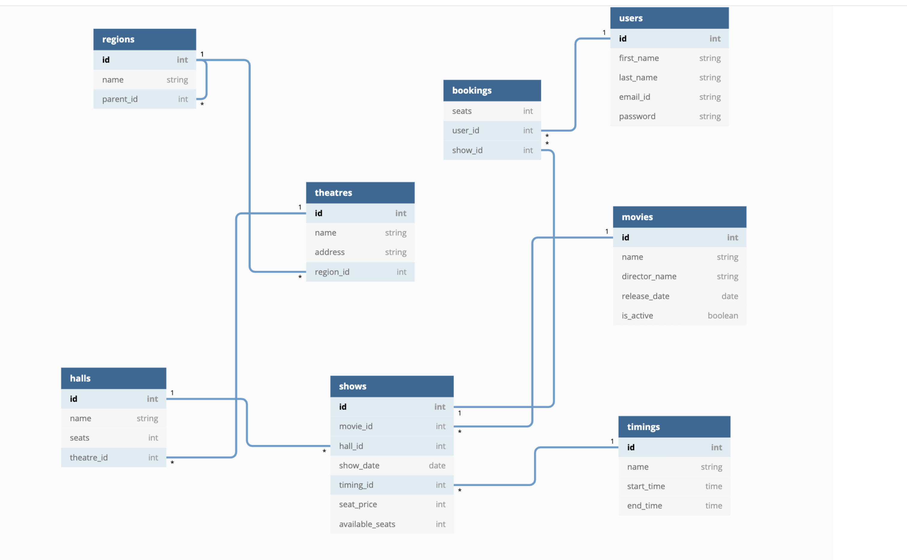

# book-my-show
This application is online movie-ticketing system backend- used for creating users, adding new halls, theatres, shows, creating new bookings,etc.
    
## Getting started
* API Documentation [link](http://localhost:8089/swagger-ui/)
* MCS resources
    * Swagger UI
        * [local-machine](http://localhost:8089/swagger-ui/)  
    * MySQL Server
        * `full_db_mysql`

### Database Schema


### Dev Setup instructions
##### Prerequisites
* golang, version 1.15
* docker
* mysql image 

##### Run mysql container locally- Must for running test cases locally
```
./scripts/run_my_sql_container_locally.sh
```

##### For testing the code-coverage in one go
```
./scripts/code_coverage_script.sh
```

##### For refreshing the mocks during development
```
./scripts/refresh_mock_files.sh
```

##### For refreshing swagger specs
```
make generate-swagger
```

##### Build the service
```
go build -o book-my-show
```

##### Start the MCS server
```
./book-my-show server
```

##### Run the tests
```
go test ./... -v -count=1
```

### Docker compose based setup
##### Run following command to 
* start the server and expose the port
* starts my-sql container
* runs all database migrations
```
docker-compose up --build
```

### Some useful docker 
```
* docker stop $(docker ps -aq)
* docker container prune
* docker rmi $(docker images -aq)
* docker network prune
```